---
## Front matter
lang: ru-RU
title: Structural approach to the deep learning method
author: |
institute: |
	\inst{1}RUDN University, Moscow, Russian Federation

date: 
## Formatting
toc: false
slide_level: 2
theme: metropolis
header-includes: 
 - \metroset{progressbar=frametitle,sectionpage=progressbar,numbering=fraction}
 - '\makeatletter'
 - '\beamer@ignorenonframefalse'
 - '\makeatother'
aspectratio: 43
section-titles: true
---

# Цель работы

Приобретение практических навыков взаимодействия пользователя с системой посредством командной строки. 

# Задание

1.Определите полное имя вашего домашнего каталога. Далее относительно этогокаталога будут выполняться последующие упражнения.2.Выполните следующие действия:
2.1.Перейдите в каталог/tmp.
2.2.Выведите на экран содержимое каталога/tmp. Для этого используйте ко-мандуlsс различными опциями. Поясните разницу в выводимой на экранинформации.
2.3.Определите, есть ли в каталоге/var/spoolподкаталог с именемcron?
2.4.Перейдите в Ваш домашний каталог и выведите на экран его содержимое.Определите, кто является владельцем файлов и подкаталогов?
3.Выполните следующие действия:
3.1.В домашнем каталоге создайте новый каталог с именемnewdir.
3.2.В каталоге~/newdirсоздайте новый каталог с именемmorefun.
3.3.В домашнем каталоге создайте одной командой три новых каталога с име-намиletters,memos,misk. Затем удалите эти каталоги одной командой.
3.4.Попробуйте удалить ранее созданный каталог~/newdirкомандойrm. Про-верьте, был ли каталог удалён.
3.5.Удалите каталог~/newdir/morefunиз домашнего каталога. Проверьте,был ли каталог удалён.
4.С помощью командыmanопределите, какую опцию командыlsнужно исполь-зовать для просмотра содержимое не только указанного каталога, но и подката-логов, входящих в него.
5.С помощью командыmanопределите набор опций командыls, позволяющий от-сортировать по времени последнего изменения выводимый список содержимогокаталога с развёрнутым описанием файлов.
6.Используйте командуmanдля просмотра описания следующих команд:cd,pwd,mkdir,rmdir,rm. Поясните основные опции этих команд.
7.Используя информацию, полученную при помощи командыhistory, выполнитемодификацию и исполнение нескольких команд из буфера команд.

# Выполнение лабораторной работы

1.Определил полное имя домашнего каталога. 

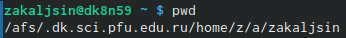{ #fig:001 width=70% }

## Слайд 1

2.Выполнил следующие действия:

2.1. Перешол в каталог /tmp.

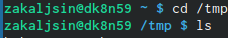{ #fig:001 width=70% }

## Слайд 2

2.2. Вывел на экран содержимое каталога /tmp. Для этого использовал команду ls с различными опциями. 

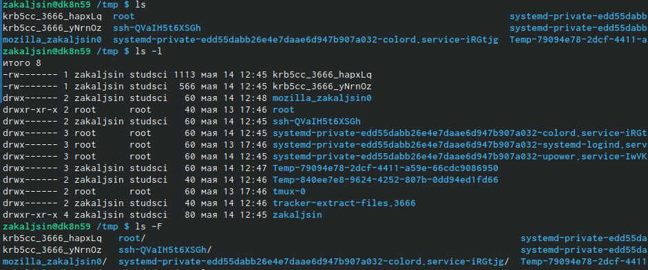{ #fig:001 width=70% }

## Слайд 3

Разница в выводимой на экран информации:

Команда ls выводит содержимое каталога.

Команда ls -l выводит подробный список, в котором будет отображаться владелец, группа, дата создания, размер и другие параметры.

Команда ls -F показывает тип объекта.
## Слайд 4

2.3. Определил, есть ли в каталоге /var/spool подкаталог с именем cron

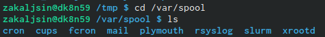{ #fig:001 width=70% }
## Слайд 5

2.4. Перешол в свой домашний каталог и вывел на экран его содержимое.

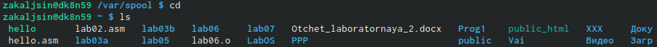{ #fig:001 width=70% }
## Слайд 6

Определил, кто является владельцем файлов и подкаталогов (третий столбик). 

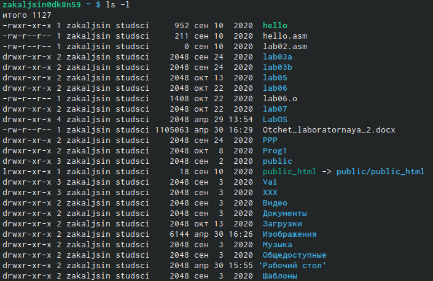{ #fig:001 width=70% }
## Слайд 7

3. Выполнил следующие действия:

3.1. В домашнем каталоге создал новый каталог с именем newdir. 

{ #fig:001 width=70% }
## Слайд 8

3.2. В каталоге ~/newdir создал новый каталог с именем morefun
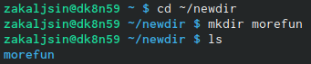{ #fig:001 width=70% }
## Слайд 9

3.3. В домашнем каталоге создал одной командой три новых каталога с именами letters, memos, misk. Затем удалил эти каталоги одной командой.
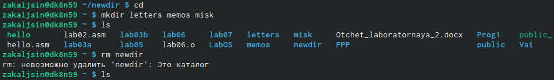{ #fig:001 width=70% }
## Слайд 10

3.4. Попробовал удалить ранее созданный каталог ~/newdir командой rm. Проверил, был ли каталог удалён.
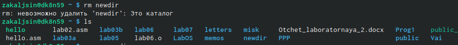{ #fig:001 width=70% }
## Слайд 11

3.5. Удалил каталог ~/newdir/morefun из домашнего каталога. Проверил,
был ли каталог удалён.
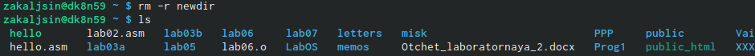{ #fig:001 width=70% }

## Слайд 12
4. С помощью команды man определил, какую опцию команды ls нужно использовать для просмотра содержимого не только указанного каталога, но и подкаталогов, входящих в него. 
{ #fig:001 width=70% }
## Слайд 13

5. С помощью команды man определил набор опций команды ls, позволяющий отсортировать по времени последнего изменения выводимый список содержимого
каталога с развёрнутым описанием файлов. 
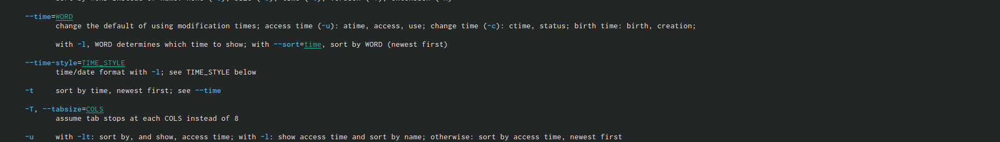{ #fig:001 width=70% }
## Слайд 14

6. Использовал команду man для просмотра описания следующих команд: cd, pwd,
mkdir, rmdir, rm. 
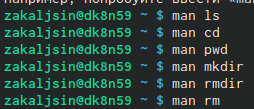{ #fig:001 width=70% }
## Слайд 15
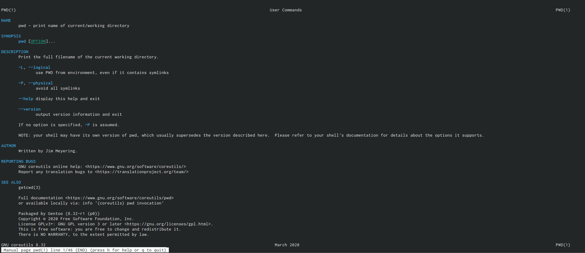{ #fig:001 width=70% }
## Слайд 16
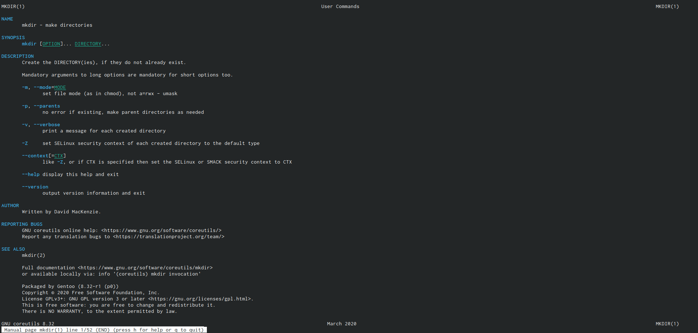{ #fig:001 width=70% }
## Слайд 17
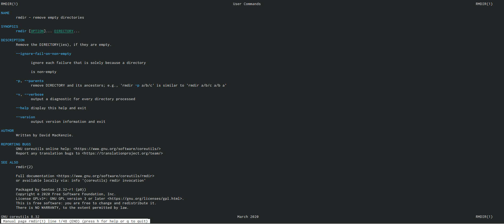{ #fig:001 width=70% }
## Слайд 18
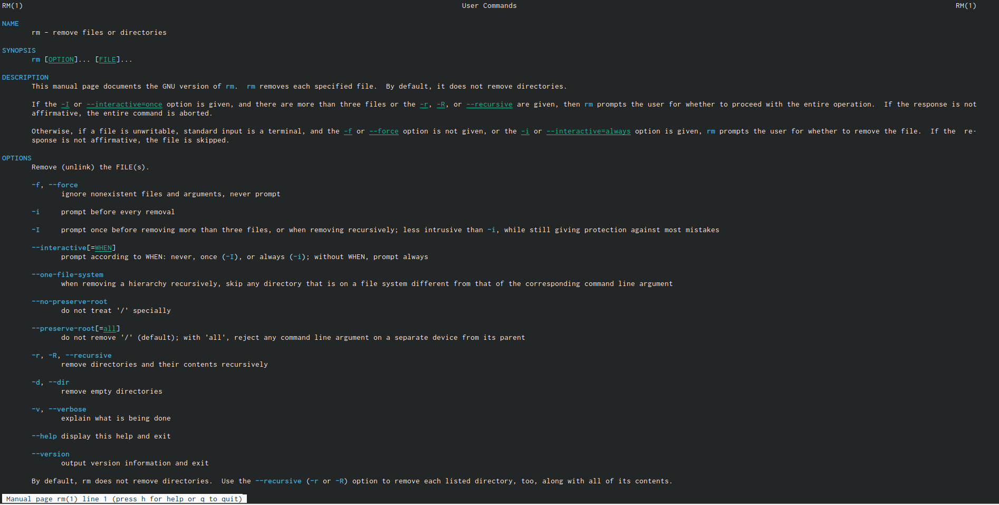{ #fig:001 width=70% }
## Слайд 19

Основные опции этих команд:

cd – команда перемещения по файловой системе.

pwd – команда показывающая директорию, в которой находится пользователь.

mkdir – команда, создающая новую директорию.

rmdir – команда, удаляющая файлы, которые должны быть пустыми.

rm - команда, удаляющая файлы или целые деревья каталогов.

## Слайд 20
7. Используя информацию, полученную при помощи команды history, выполнил

модификацию и исполнение нескольких команд из буфера команд.
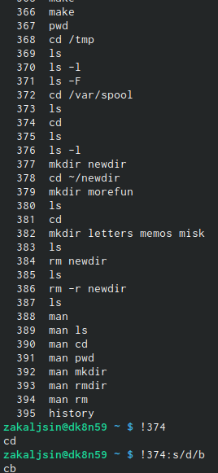{ #fig:001 width=70% }
## Слайд 21

# Выводы

Приобрел практические навыки взаимодействия пользователя с системой посредством командной строки.

## Слайд 22
# Ответы на контрольные вопросы:

1.Интерфейс командной строки - управление программами с помощью команд. Команды состоят из букв, цифр, символов, набираются построчно, выполняются после нажатия клавиши Enter. Основной инструмент здесь клавиатура. Данный интерфейс встроен в ядро системы, он будет доступен, даже если графический интерфейс не запустится. Добраться до командной строки можно двумя способами: через консоль или терминал.

2.При помощи команды realpath можно определить абсолютный путь текущего каталога. Например, если вбить realpath var на экран выведется /home/<username>/var.

3. При помощи команды ls -F можно определить только тип файлов и их имена в текущем каталоге.
## Слайд 23
4. Файл (или директория) считается скрытым, если его название начинается с символа точка «.». Например, «.myfile». Обычно такие файлы используются приложениями для хранения настроек, конфигураций и другой информации, которую нужно скрыть от пользователя. Зачастую пользователю требуется отредактировать соответствующий конфигурационный скрытый файл, чтобы настроить какую-нибудь программу, и пользователи сталкиваются с тем, что не знают, как их вообще просмотреть. По

умолчанию файловые менеджеры обычно не отображают такие файлы.
## Слайд 24
Для просмотра списка файлов в командной строке используется команда ls. Чтобы по команде ls также выводились скрытые файлы, существует опция -a.

5. При помощи команд rm и rmdir можно удалить файл и каталог. Это нельзя сделать одной и той же командой. rmdir используется, чтобы удалить файлы, которые должны быть пустые. rm используется, чтобы удалить непустые файлы или целые деревья каталогов.

6. Определить какие команды выполнил пользователь в сеансе работы можно с помощь команды history.
## Слайд 25
7. Исправить и запустить на выполнение команду, которую пользователь уже использовал в сеансе работы, можно с помощью команды: !<номер_команды>:s/<что_меняем>/<на_что_меняем> Например,

history

.

.

3 ls -a .

.

!3:s/a/F

ls -F
## Слайд 26
8. В одной строке можно записать несколько команд. Если требуется выполнить последовательно несколько команд, записанный в одной строке, то для этого используется символ точка с запятой. Пример: cd; ls.

9.Экранирование — это способ заключения в кавычки одиночного символа. Экранирующий символ (\) сообщает интерпретатору, что следующий за ним символ должен восприниматься как обычный символ. Пример:

echo "Привет" # Привет

echo "Он сказал: \"Привет\"." # Он сказал: "Привет".
## Слайд 27
10. Если используется опция l в команде ls, то на экран выводится подробный список, в котором будет отображаться владелец, группа, дата создания, размер и другая информация о файлах и каталогах.

11. Относительный путь – это путь к файлу относительно текущей папки. При

использовании команды pwd на экран выведется относительный путь текущей директории, а при использовании команды realpath на экран выведется абсолютный путь текущей директории.
## Слайд 28
12. Получить информацию об интересующей вас команде можно с помощью команды man. Например, команда man ls выведет все опции команды ls.

13. Сочетание клавиш Ctrl+C прерывает текущий процесс, запущенный в терминале

