---
## Front matter
lang: ru-RU
title: Лабораторная работа № 6.
author: "Кальсин З. А."
institute: 
	\inst{1}RUDN University, Moscow, Russian Federation

date: 
## Formatting
toc: false
slide_level: 2
theme: metropolis
header-includes: 
 - \metroset{progressbar=frametitle,sectionpage=progressbar,numbering=fraction}
 - '\makeatletter'
 - '\beamer@ignorenonframefalse'
 - '\makeatother'
aspectratio: 43
section-titles: true
---

# Цель работы

Ознакомиться с файловой системой Linux, её структурой, именами и содержанием каталогов. Приобрести практические навыки по применению команд для работы с файлами и каталогами, по управлению процессами (и работами), по проверке использования диска и обслуживанию файловой системы.

# Выполнение лабораторной работы

1.Выполнила все примеры, приведённые в первой части описания лабораторной работы.

Скопировала файл ~/abc1 в файл april и в файл may. Скопировала файлы april и may в каталог monthly. Скопировала файл monthly/may в файл с именем june. Скопировала каталог monthly в каталог monthly.00. Скопировала каталог monthly.00 в каталог /tmp.
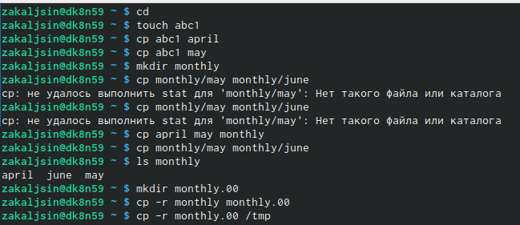{ #fig:001 width=70% }

## Слайд 1

Изменила название файла april на july в домашнем каталоге. Переместила файл july в каталог monthly.00. Переименовала каталог monthly.00 в monthly.01. Переместила каталог monthly.01в каталог reports. Переименовала каталог reports/monthly.01 в reports/monthly.
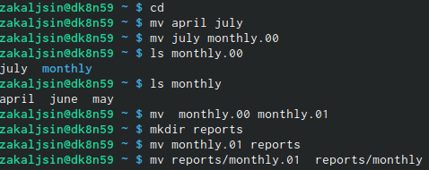{ #fig:001 width=70% }

## Слайд 2

Создала файл ~/may с правом выполнения для владельца. Лишила владельца файла ~/may права на выполнение. Создала каталог monthly с запретом на чтение для членов группы и всех остальных пользователей. Создала файл ~/abc1 с правом записи для членов группы.
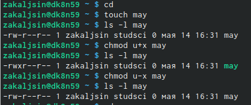{ #fig:001 width=70% }

## Слайд 3

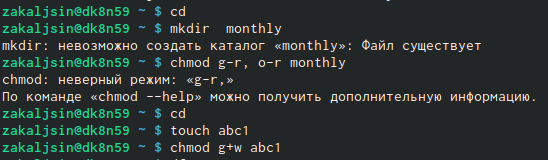{ #fig:001 width=70% }

## Слайд 4

Воспользовалась командой df, которая выведет на экран список всех файловых

систем в соответствии с именами устройств, с указанием размера и точки монтирования, для определения объёма свободного пространства на файловой системе. С помощью команды fsck проверила целостность файловой системы.
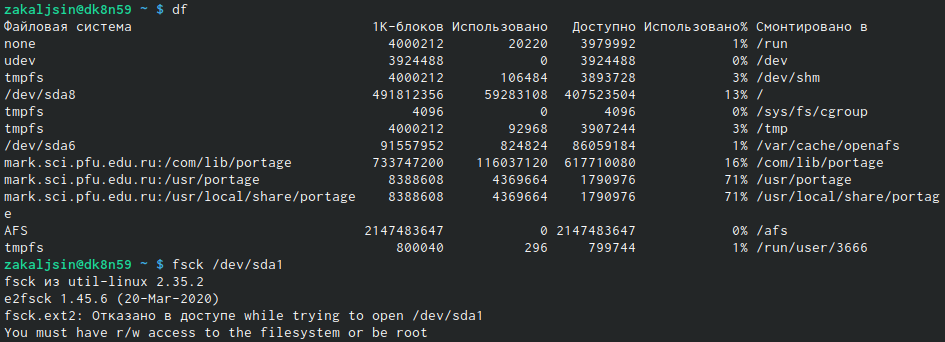{ #fig:001 width=70% }

## Слайд 5

2. Выполнила следующие действия, зафиксировав в отчёте по лабораторной работе

используемые при этом команды и результаты их выполнения:

2.1. Скопировала файл /usr/include/xorg/isdv4.h в домашний каталог, с помощью команды cp и назвала его equipment, с помощью команды mv.

2.2. В домашнем каталоге создала директорию ~/ski.plases.
{ #fig:001 width=70% }

## Слайд 6

2.3. Переместила файл equipment в каталог ~/ski.plases командой mv.

2.4. Переименовала файл ~/ski.plases/equipment в ~/ski.plases/equiplist командой mv.

2.5. Создала в домашнем каталоге файл abc1 и скопировала его в каталог ~/ski.plases командой cp, назвала его equiplist2 командой mv.
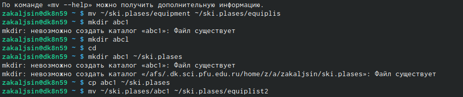{ #fig:001 width=70% }

## Слайд 7

2.6. Создала каталог с именем equipment в каталоге ~/ski.plases командой mkdir.

2.7. Переместила файлы ~/ski.plases/equiplist и equiplist2 в каталог ~/ski.plases/equipment командой mv.

2.8. Создала и переместила каталог ~/newdir в каталог ~/ski.plases командами mkdir и mv и назвала его plans командой mv.
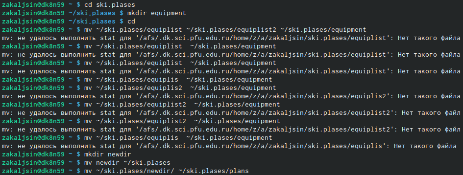{ #fig:001 width=70% }

## Слайд 8

3. Определила опции команды chmod, необходимые для того, чтобы присвоить перечисленным ниже файлам выделенные права доступа, считая, что в начале таких прав нет. При необходимости создала нужные файлы.

## Слайд 9

3.1. drwxr--r-- ... australia
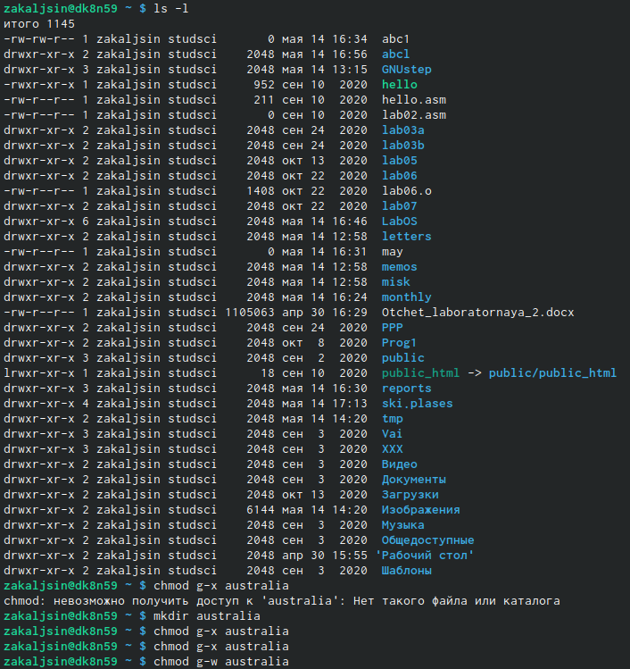{ #fig:001 width=70% }

## Слайд 10

3.2. drwx--x--x ... play
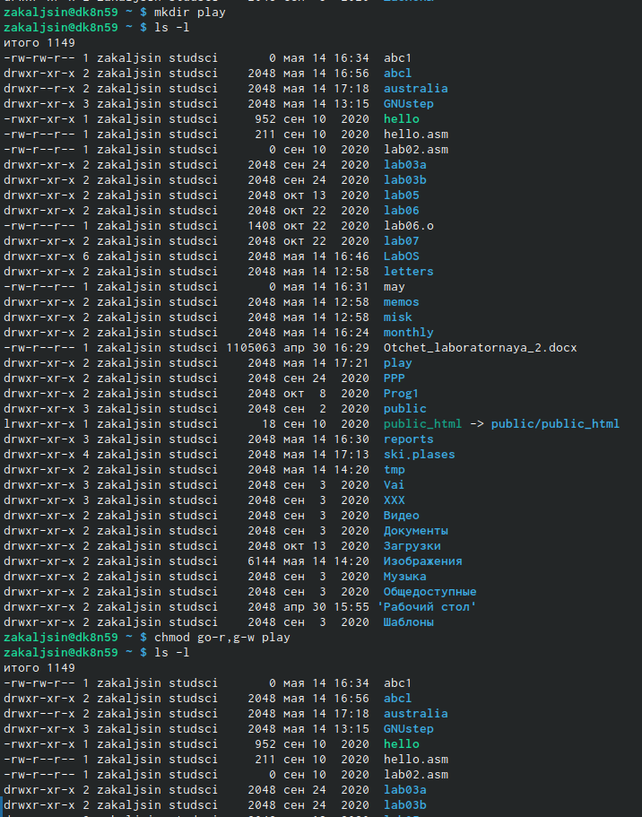{ #fig:001 width=70% }

## Слайд 11

3.3. -r-xr--r-- ... my_os
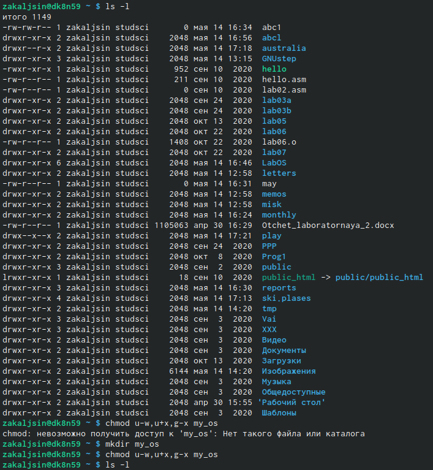{ #fig:001 width=70% }

## Слайд 12

3.4. -rw-rw-r-- ... feathers
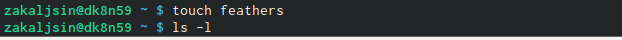{ #fig:001 width=70% }

## Слайд 13

4. Проделала приведённые ниже упражнения, записывая в отчёт по лабораторной

работе используемые при этом команды:

4.1. Не просмотрела содержимое файла /etc/password, так как у меня его нет.
{ #fig:001 width=70% }

## Слайд 14

4.2. Скопировала файл ~/feathers в файл ~/file.old командой cp.

4.3. Переместила файл ~/file.old в каталог ~/play командой mv.
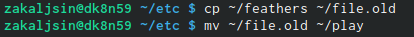{ #fig:001 width=70% }

## Слайд 15

4.4. Скопировала каталог ~/play в каталог ~/fun командой cp -r.

4.5. Переместила каталог ~/fun в каталог ~/play командой mv и назвала его games командой mv.
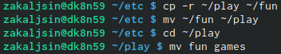{ #fig:001 width=70% }

## Слайд 16

4.6. Лишила владельца файла ~/feathers права на чтение командой chmod u-r.

4.7. Если попытаться просмотреть файл ~/feathers командой cat, то выведется:

## Слайд 17

4.8. Если попытаться скопировать файл ~/feathers командой cp, то выведется:

4.9. Дала владельцу файла ~/feathers право на чтение командой chmod u+r.

## Слайд 18

4.10. Лишила владельца каталога ~/play права на выполнение командой chmod u-x.
## Слайд 19
4.11. Попыталась перейти в каталог ~/play командой cd.

4.12. Дала владельцу каталога ~/play право на выполнение командой chmod u+x.
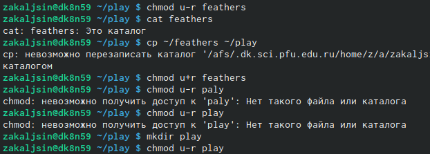{ #fig:001 width=70% }

## Слайд 20

5. Прочитала man по командам mount, fsck, mkfs, kill.
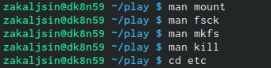{ #fig:001 width=70% }

## Слайд 21

Краткая характеристика:

- mount применяется для монтирования файловых систем.

- fsck восстанавливает повреждённую файловую систему или проверяет на целостность.

- mkfs создаёт новую файловую систему.

- kill используется для принудительного завершения работы приложений.

# Выводы

 Ознакомилась с файловой системой Linux, её структурой, именами и содержанием каталогов. Приобрела практические навыки по применению команд для работы с файлами и каталогами, по управлению процессами (и работами), по проверке использования диска и обслуживанию файловой системы.

# Ответы на контрольные вопросы:

1.Характеристика файловой системы, которая использовалась в данной лабораторной работе:

Файлы: abc1, april, may, june, july, isdv4.h, equipment, equiplist, equiplist2, my_os, feathers, file.old. Каталоги: monthly, monthly.00, tmp, monthly.01, reports, usr, include, xorg, ski.plases, equipment, newdir, plans, australia, play, etc, fun, games.

2.Пример общей структуры файловой системы: /home/pdarzhankina/monthly/april, где /home/pdarzhankina – домашний каталог, /monthly – каталог, находящийся в домашнем и содержащий файл, /аpril – файл, находящийся в каталоге.

3. Чтобы содержимое некоторой файловой системы было доступно операционной системе должно быть выполнено монтирование тома.

## Слайд 22

4. Основные причины нарушения целостности файловой системы:

- Один блок адресуется несколькими mode (принадлежит нескольким файлам).

- Блок помечен как свободный, но в то же время занят (на него ссылается onode).

- Блок помечен как занятый, но в то же время свободен (ни один inode на него не ссылается).

- Неправильное число ссылок в inode (недостаток или избыток ссылающихся записей в каталогах).

## Слайд 23

- Несовпадение между размером файла и суммарным размером адресуемых inode блоков.

- Недопустимые адресуемые блоки (например, расположенные за пределами файловой системы).

- "Потерянные" файлы (правильные inode, на которые не ссылаются записи каталогов).

## Слайд 24

- Недопустимые или неразмещенные номера inode в записях каталогов.

Чтобы устранить повреждения файловой системы используется команда fsck.

5. Команда mkfs создаёт новую файловую систему.

6. Характеристика команд, которые позволяют просмотреть текстовые файлы:

## Слайд 25

- для просмотра небольших файлов удобно пользоваться командой cat.

- для просмотра больших файлов используйте команду less — она позволяет осуществлять постраничный просмотр файлов.

- для просмотра начала файла можно воспользоваться командой head, по умолчанию она выводит первые 10 строк файла.

- команда tail выводит несколько (по умолчанию 10) последних строк файла.

## Слайд 26

7. Основные возможности команды cp:

- копирование файла в текущем каталоге.

- копирование нескольких файлов в каталог.

- копирование файлов в произвольном каталоге.

Опция i в команде cp выведет на экран запрос подтверждения о перезаписи файла, если на место целевого файла вы поставите имя уже существующего файла.

Команда cp с опцией r (recursive) позволяет копировать каталоги вместе с входящими в них файлами и каталогами.

## Слайд 27

8. Характеристика команд перемещения и переименования файлов и каталогов:

- переименование файлов в текущем каталоге.

mv <старое_название_файла> <новое_название_файла>

- перемещение файлов в другой каталог.

mv <название_файла> <название_каталога>

## Слайд 28

Если необходим запрос подтверждения о перезаписи файла, то нужно использовать опцию i.

- переименование каталогов в текущем каталоге.

mv <старое_название_каталога> <новое_название_каталога>

- перемещение каталога в другой каталог.

## Слайд 29

mv <старый_каталога> <новый_каталог>

- переименование каталога, не являющегося текущим.

mv <каталог/старое_название_каталога> < каталог/новое_название_каталога>

9. Каждый файл или каталог имеет права доступа: чтение (разрешены просмотр и копирование файла, разрешён просмотр списка входящих в каталог файлов), запись (разрешены изменение и переименование файла, разрешены создание и удаление файлов каталога), выполнение (разрешено выполнение файла, разрешён доступ в

каталог и есть возможность сделать его текущим). Они могу быть изменены командой chmod.

