---
## Front matter
lang: ru-RU
title: Лабораторная работа № 7.
author: "Кальсин З. А."
institute: 
	\inst{1}RUDN University, Moscow, Russian Federation

date: 
## Formatting
toc: false
slide_level: 2
theme: metropolis
header-includes: 
 - \metroset{progressbar=frametitle,sectionpage=progressbar,numbering=fraction}
 - '\makeatletter'
 - '\beamer@ignorenonframefalse'
 - '\makeatother'
aspectratio: 43
section-titles: true
---

# Цель работы

Ознакомиться с файловой системой Linux, её структурой, именами и содержанием каталогов. Приобрести практические навыки по применению команд для работы с файлами и каталогами, по управлению процессами (и работами), по проверке использования диска и обслуживанию файловой системы.

# Выполнение лабораторной работы

1.Осуществил вход в систему, используя соответствующее имя пользователя.

## Слайд 1

2. Записал в файл file.txt названия файлов, содержащихся в каталоге /etc. Дописал в этот же файл названия файлов, содержащихся в домашнем каталоге.

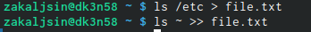{ #fig:001 width=70% }

## Слайд 2

3. Вывел имена всех файлов из file.txt, имеющих расширение .conf, после чего записал их в новый текстовой файл conf.txt.

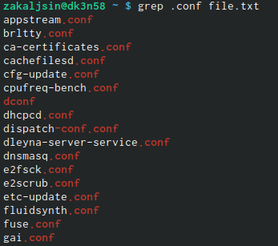{ #fig:001 width=70% }
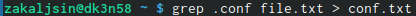{ #fig:001 width=70% }

## Слайд 3

4. Определил, какие файлы в домашнем каталоге имеют имена, начинающиеся с символа c. Несколько вариантов, как это сделать:
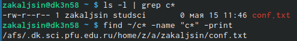{ #fig:001 width=70% }

## Слайд 4

5. Вывел на экран (по странично) имена файлов из каталога /etc, начинающиеся с символа h.
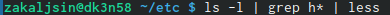{ #fig:001 width=70% }
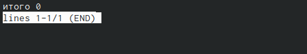{ #fig:001 width=70% }

## Слайд 5

6. Запустил в фоновом режиме процесс, который будет записывать в файл ~/logfile файлы, имена которых начинаются с log.

7. Удалил файл ~/logfile.
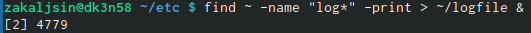{ #fig:001 width=70% }

## Слайд 6

8. Запустил из консоли в фоновом режиме редактор gedit.
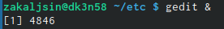{ #fig:001 width=70% }
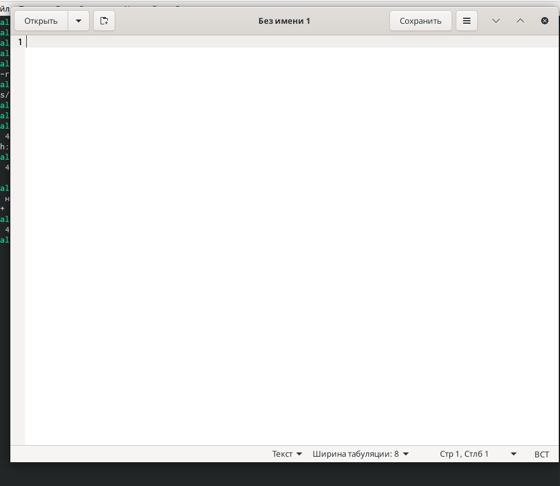{ #fig:001 width=70% }

## Слайд 7

9. Определил идентификатор процесса gedit, используя команду ps, конвейер и

фильтр grep. Более простым способом определить этот идентификатор не получилось.

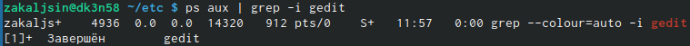{ #fig:001 width=70% }

## Слайд 8

10. Прочла справку (man) команды kill, после чего использовал её для завершения процесса gedit.
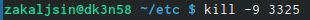{ #fig:001 width=70% }
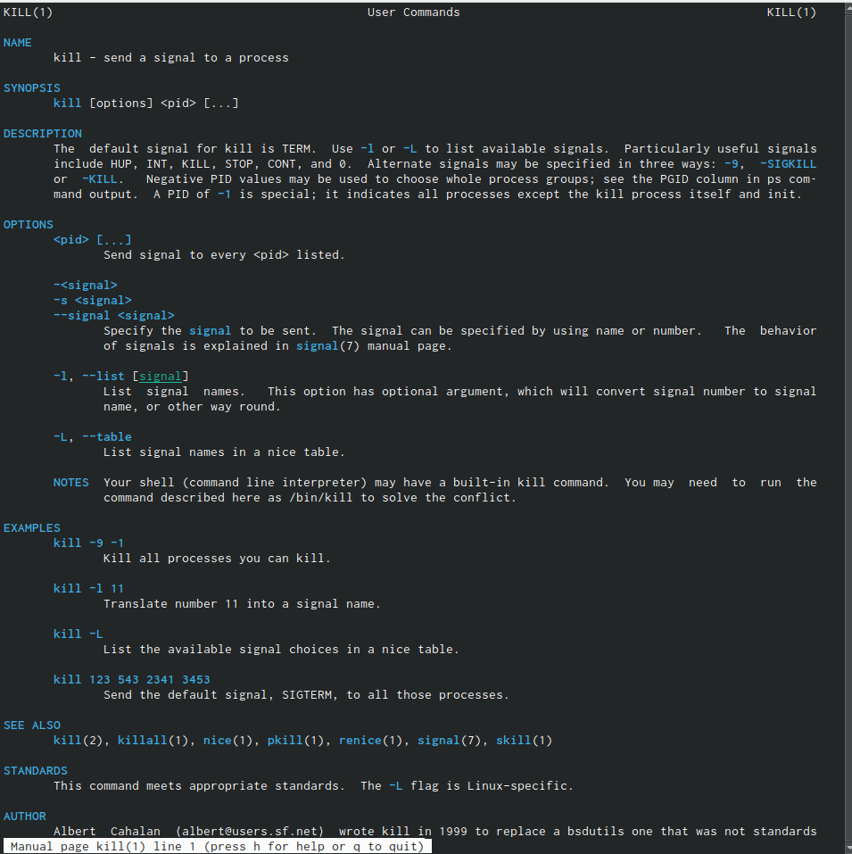{ #fig:001 width=70% }

## Слайд 9

11. Выполнил команды df и du, предварительно получив более подробную информацию об этих командах, с помощью команды man.
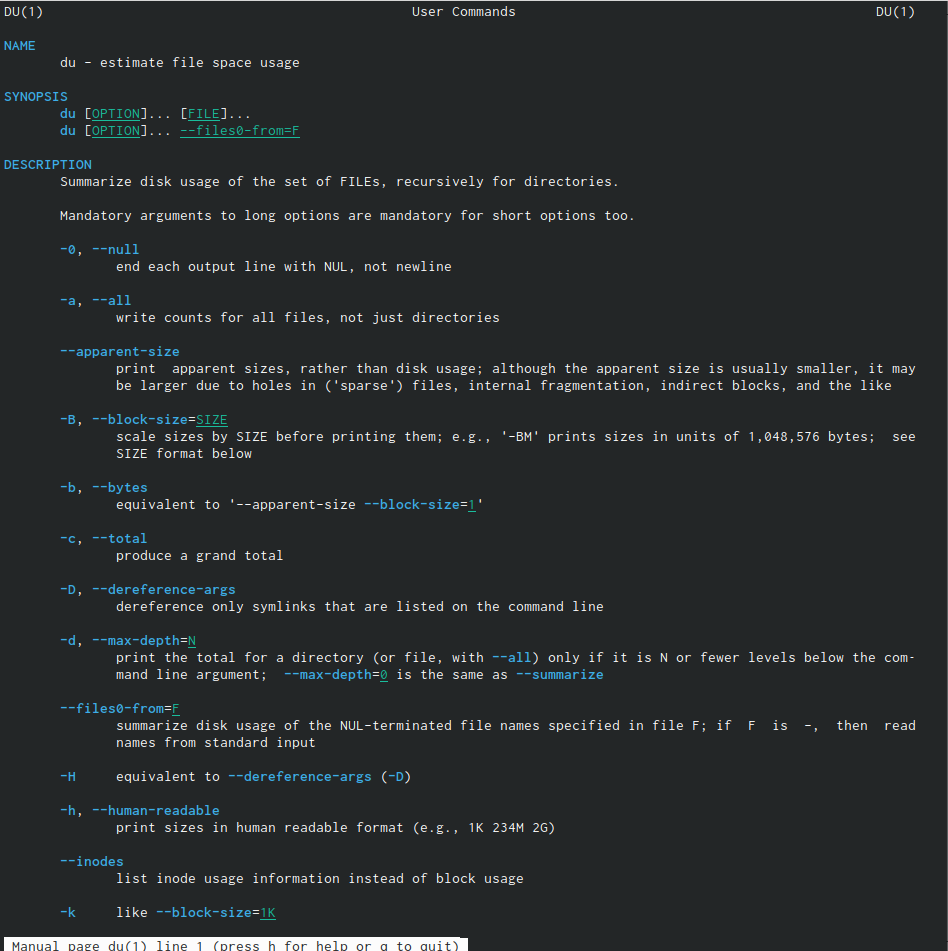{ #fig:001 width=70% }

## Слайд 10

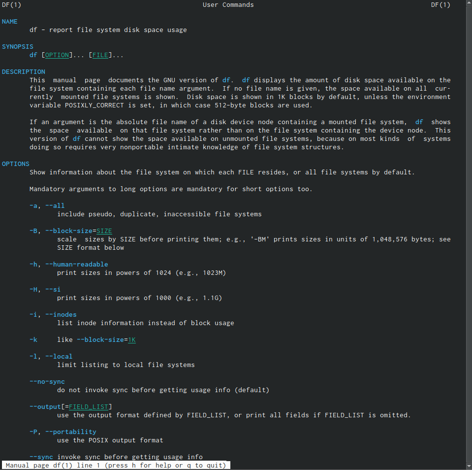{ #fig:001 width=70% }

## Слайд 11

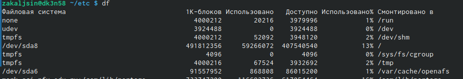{ #fig:001 width=70% }
{ #fig:001 width=70% }

## Слайд 12

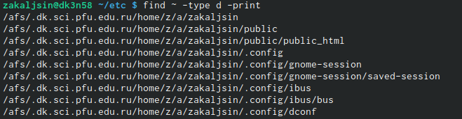{ #fig:001 width=70% }

## Слайд 13

12. Воспользовавшись справкой команды find, вывел имена всех директорий, имеющихся в домашнем каталоге.
{ #fig:001 width=70% }
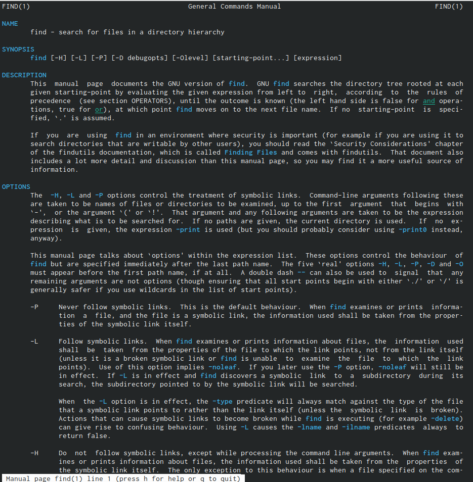{ #fig:001 width=70% }

# Выводы

 Ознакомился с инструментами поиска файлов и фильтрацией текстовых данных, приобрел практические навыки: по управлению процессами (и заданиями), по проверке использования диска и обслуживанию файловых систем.

# Ответы на контрольные вопросы:

1. В системе по умолчанию открыто три специальных потока:

– stdin — стандартный поток ввода (по умолчанию: клавиатура), файловый дескриптор 0;

– stdout — стандартный поток вывода (по умолчанию: консоль), файловый дескриптор 1;

– stderr — стандартный поток вывод сообщений об ошибках (по умолчанию: консоль), файловый дескриптор 2. 2. > - перенаправление stdout (вывода) в файл. Если файл отсутствовал, то он создаётся, иначе - перезаписывается. >> - перенаправление stdout (вывода) в файл. Если файл отсутствовал, то он создаётся, иначе - добавляется. 3. Конвейер (pipe) служит для объединения простых команд или утилит в цепочки,

## Слайд 14

в которых результат работы предыдущей команды передаётся последующей.

4. Процесс это - совокупность программного кода и данных, загруженных в память ЭВМ. Любой команде, выполняемой в системе, присваивается идентификатор процесса (process ID). Получить информацию о процессе и управлять им, пользуясь

идентификатором процесса, можно из любого окна командного интерпретатора. Процессом называют выполняющуюся программу и все её элементы: адресное пространство, глобальные переменные, регистры, стек, открытые файлы и так далее.

## Слайд 15

5. PID — уникальный номер (идентификатор) процесса в многозадачной ОС.

GID – идентификатор группы.

6. Любую выполняющуюся в консоли команду или внешнюю программу можно запустить в фоновом режиме. Запущенные фоном программы называются задачами (jobs). Ими можно управлять с помощью команды jobs, которая выводит список запущенных в данный момент задач. Для завершения задачи необходимо выполнить команду kill %номер задачи.

7. Команда top в Linux системах позволяет вывести в виде таблицы перечень

## Слайд 16

запущенных процессов и оценить, какой объем ресурсов они потребляют, т.е., какую нагрузку создают на сервер и дисковую подсистему.

Команда htop — продвинутый монитор процессов, показывает динамический список системных процессов, список обычно выравнивается по использованию ЦПУ. В отличие от top, htop показывает все процессы в системе. Также показывает время непрерывной работы, использование процессоров и памяти. htop часто применяется в тех случаях, когда информации даваемой утилитой top недостаточно, например при поиске утечек памяти в процессах.

## Слайд 17

8. Команда find используется для поиска и отображения имён файлов, соответствующих заданной строке символов. Формат команды: find путь [-опции]

Путь определяет каталог, начиная с которого по всем подкаталогам будет вестись

поиск. Примеры:

- вывести на экран имена файлов из вашего домашнего каталога и его подкаталогов, начинающихся на f: find ~ -name "f*" -print

- вывести на экран имена файлов в каталоге /etc, начинающихся с символа p:

find /etc -name "p*" -print

- найти в вашем домашнем каталоге файлы, имена которых заканчиваются символом и удалить их: find ~ -name "*~" -exec rm "{}" \;

## Слайд 18

9. Найти файл по контексту (содержанию) позволяет команда grep.

Формат команды: grep строка имя_файла

Примеры:

- показать строки во всех файлах в вашем домашнем каталоге с именами, начинающимися на f, в которых есть слово begin: grep begin f*

- найти в текущем каталоге все файлы, в имени которых есть буквосочетание «лаб»:

ls -l | grep лаб

## Слайд 19

10. Определить объем свободной памяти на жёстком диске позволяет команда df.

11. Определить объем домашнего каталога позволяет команда df /home/<user_name>

12. Удалить зависший процесс можно командой kill %номер задачи.