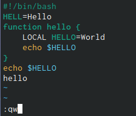

---
## Front matter
lang: ru-RU
title: Лабораторная работа № 9.
author: "Кальсин З. А."
institute: 
	\inst{1}RUDN University, Moscow, Russian Federation

date: 
## Formatting
toc: false
slide_level: 2
theme: metropolis
header-includes: 
 - \metroset{progressbar=frametitle,sectionpage=progressbar,numbering=fraction}
 - '\makeatletter'
 - '\beamer@ignorenonframefalse'
 - '\makeatother'
aspectratio: 43
section-titles: true
---

# Цель работы

  Познакомиться с операционной системой Linux, получить практические навыки работы с редактором vi, установленным по умолчанию практически во всех дистрибутивах. 
# Выполнение лабораторной работы

Задание 1. Создание нового файла с использованием vi.

1.Создал каталог с именем ~/work/os/lab06.

2. Перешол во вновь созданный каталог.

3. Вызвал vi и создал файл hello.sh
{ #fig:001 width=70% }

## Слайд 1

4. Нажал клавишу i и ввел следующий текст:

#!/bin/bash
HELL=Hello
function hello {
LOCAL HELLO=World
echo $HELLO
}
echo $HELLO
hello
{ #fig:001 width=70% }

## Слайд 2

5. Нажал клавишу Esc для перехода в командный режим после завершения ввода

текста.

## Слайд 3

6. Нажала «:» для перехода в режим последней строки и внизу экрана появилось

приглашение в виде двоеточия.
{ #fig:001 width=70% }
7. Нажал w (записать) и q (выйти), а затем нажал клавишу Enter для сохранения текста и завершения работы.
{ #fig:001 width=70% }

## Слайд 4

8. Сделал файл исполняемым.
{ #fig:001 width=70% }

## Слайд 5

Задание 2. Редактирование существующего файла.

1.Вызвал vi на редактирование файла.
{ #fig:001 width=70% }
2. Установил курсор в конец слова HELL второй строки.
{ #fig:001 width=70% }

## Слайд 6

3. Перешел в режим вставки и заменил на HELLO. Нажала Esc для возврата в

командный режим.
{ #fig:001 width=70% }

## Слайд 7

4. Установил курсор на четвертую строку и стёр слово LOCAL.
{ #fig:001 width=70% }

## Слайд 8

5. Перешол в режим вставки и набрал следующий текст: local, нажал Esc для

возврата в командный режим.
{ #fig:001 width=70% }

## Слайд 9

6. Установил курсор на последней строке файла. Вставил после неё строку, содержащую следующий текст: echo $HELLO.
{ #fig:001 width=70% }

## Слайд 10

7. Нажал Esc для перехода в командный режим.

8. Удалил последнюю строку.
{ #fig:001 width=70% }

## Слайд 11

9. Ввел команду отмены изменений u для отмены последней команды.
{ #fig:001 width=70% }

## Слайд 12

10. Ввел символ «:» для перехода в режим последней строки. Записал произведённые изменения и вышла из vi.
{ #fig:001 width=70% }

## Слайд 13

# Вывод

 Познакомился с операционной системой Linux, получил практические навыки работы с редактором vi, установленным по умолчанию практически во всех дистрибутивах. 

 # Ответы на контрольные вопросы 

 1.Краткая характеристика режимов работы редактора vi:

– командный режим — предназначен для ввода команд редактирования и навигации по редактируемому файлу;

– режим вставки — предназначен для ввода содержания редактируемого файла;

– режим последней (или командной) строки — используется для записи изменений

в файл и выхода из редактора.

## Слайд 14

2. Выйти из редактора, не сохраняя произведённые изменения, можно используя клавиши «:q!» в командном режиме.

3. Краткую характеристика команд позиционирования:

– 0 (ноль) — переход в начало строки;

– $ — переход в конец строки;

– G — переход в конец файла;

– n G — переход на строку с номером n.

## Слайд 15

4. Для редактора vi словом является: пробел; буквы, находящиеся между двумя пробелами.

5. Из любого места редактируемого файла перейти в конец файла можно с помощью клавишы G и курсора вниз, а в начало – курсор вверх.

6. Краткая характеристика основных групп команд редактирования:

Вставка текста

– а — вставить текст после курсора;

– А — вставить текст в конец строки;

– i — вставить текст перед курсором;

– n i — вставить текст n раз;

– I — вставить текст в начало строки.

## Слайд 16

Вставка строки

– о — вставить строку под курсором;

– О — вставить строку над курсором. Удаление текста

– x — удалить один символ в буфер;

– d w — удалить одно слово в буфер;

– d $ — удалить в буфер текст от курсора до конца строки;

## Слайд 17

– d 0 — удалить в буфер текст от начала строки до позиции курсора;

– d d — удалить в буфер одну строку;

– n d d — удалить в буфер n строк. Отмена и повтор произведённых изменений

– u — отменить последнее изменение;

– . — повторить последнее изменение.

Копирование текста в буфер

– Y — скопировать строку в буфер;

## Слайд 18

– n Y — скопировать n строк в буфер;

– y w — скопировать слово в буфер.

Вставка текста из буфера

– p — вставить текст из буфера после курсора;

– P — вставить текст из буфера перед курсором. Замена текста

– c w — заменить слово;

## Слайд 19

– n c w — заменить n слов;

– c $ — заменить текст от курсора до конца строки;

– r — заменить слово;

## Слайд 20

– R — заменить текст.

Поиск текста

– / текст — произвести поиск вперёд по тексту указанной строки символов текст;

– ? текст — произвести поиск назад по тексту указанной строки символов текст. 7. Чтобы заполнить строку символами $ можно использовать клавиши ni(вставить текст n раз).

8. Отменить некорректное действие, связанное с процессом редактирования, можно с помощью клавиши «.».

9. Характеристика основных групп команд режима последней строки:

Копирование и перемещение текста

## Слайд 21

– : n,m d — удалить строки с n по m;

– : i,j m k — переместить строки с i по j, начиная со строки k;

– : i,j t k — копировать строки с i по j в строку k;

– : i,j w имя-файла — записать строки с i по j в файл с именем имя-файла.

Запись в файл и выход из редактора

## Слайд 22

– : w — записать изменённый текст в файл, не выходя из vi;

– : w имя-файла — записать изменённый текст в новый файл с именем имяфайла;

– : w ! имя-файла — записать изменённый текст в файл с именем имяфайла;

– : w q — записать изменения в файл и выйти из vi;

– : q — выйти из редактора vi;

## Слайд 23

– : q ! — выйти из редактора без записи;

– : e ! — вернуться в командный режим, отменив все изменения, произведённые со времени последней записи.

10. Определить, не перемещая курсора, позицию, в которой заканчивается строка, можно используя клавишу $ (переход в конец строки).

11. Опции редактора vi позволяют настроить рабочую среду. Для задания опций

используется команда set (в режиме последней строки):

## Слайд 24

– : set all — вывести полный список опций;

– : set nu — вывести номера строк;

– : set list — вывести невидимые символы;

– : set ic — не учитывать при поиске, является ли символ прописным или

## Слайд 25

строчным.

Если вы хотите отказаться от использования опции, то в команде set перед именем опции надо поставить no.

12. Определить режим работы редактора vi можно по последней командной строке.

13. Взаимосвязь режимов работы редактора vi:

«Командный режим» - «Режим вставки»

\ /

«Режим командной строки» 