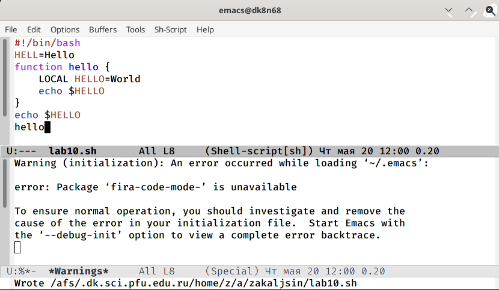

---
## Front matter
lang: ru-RU
title: Лабораторная работа № 9.
author: "Кальсин З. А."
institute: 
	\inst{1}RUDN University, Moscow, Russian Federation

date: 
## Formatting
toc: false
slide_level: 2
theme: metropolis
header-includes: 
 - \metroset{progressbar=frametitle,sectionpage=progressbar,numbering=fraction}
 - '\makeatletter'
 - '\beamer@ignorenonframefalse'
 - '\makeatother'
aspectratio: 43
section-titles: true
---

# Цель работы

  Познакомиться с операционной системой Linux, получить практические навыки работы с редактором Emacs. 
# Выполнение лабораторной работы

1.Открыл emacs.
{ #fig:001 width=70% }

## Слайд 1

2.Создал файл lab07.sh с помощью комбинации Ctrl-x Ctrl-f (C-x C-f).
{ #fig:001 width=70% }

## Слайд 2

3.Набрал текст:
{ #fig:001 width=70% }

## Слайд 3

#!/bin/bash

HELL=Hello

function hello {

LOCAL HELLO=World

echo $HELLO

}

echo $HELLO

hello

## Слайд 4

4. Сохранил файл с помощью комбинации Ctrl-x Ctrl-s (C-x C-s).
{ #fig:001 width=70% }

## Слайд 5

5. Проделаk с текстом стандартные процедуры редактирования, каждое действие осуществлялось комбинацией клавиш.

5.1. Вырезал одной командой целую строку (С-k).

{ #fig:001 width=70% }

## Слайд 6

5.2. Вставил эту строку в конец файла (C-y).
{ #fig:001 width=70% }

## Слайд 7

5.3. Выделил область текста (C-space).
{ #fig:001 width=70% }

## Слайд 8

5.4. Скопировал область в буфер обмена (M-w).

5.5. Вставил область в конец файла.
{ #fig:001 width=70% }

## Слайд 9

5.6. Вновь выделил эту область и на этот раз вырезал её (C-w).
{ #fig:001 width=70% }

## Слайд 10

5.7. Отменил последнее действие (C-/).
{ #fig:001 width=70% }

## Слайд 11

6. Научилась использовать команды по перемещению курсора.

6.1. Переместил курсор в начало строки (C-a).

6.2. Переместил курсор в конец строки (C-e).

6.3. Переместил курсор в начало буфера (M-<).

6.4. Переместил курсор в конец буфера (M->).

## Слайд 12

7. Управление буферами.

7.1. Вывел список активных буферов на экран (C-x C-b).
{ #fig:001 width=70% }

## Слайд 13

7.2. Переместилась во вновь открытое окно (C-x) o со списком открытых буферов и переключилась на другой буфер.
{ #fig:001 width=70% }

## Слайд 14

7.3. Закрыл это окно (C-x 0).
{ #fig:001 width=70% }

## Слайд 15

7.4. Вновь переключился между буферами, но без вывода их списка на экран (C-x b).
{ #fig:001 width=70% }

## Слайд 16

8. Управление окнами.

8.1. Поделил фрейм на 4 части: разделила фрейм на два окна по вертикали
{ #fig:001 width=70% }
(C-x 3), а затем каждое из этих окон на две части по горизонтали (C-x 2).

## Слайд 17

8.2. В каждом из четырёх созданных окон открыл новый буфер (файл) и ввела несколько строк текста.

9. Режим поиска

## Слайд 18

9.1. Переключился в режим поиска (C-s) и нашла несколько слов, присутствующих в тексте.
{ #fig:001 width=70% }

## Слайд 19

9.2. Переключался между результатами поиска, нажимая C-s.
{ #fig:001 width=70% }

## Слайд 20

9.3. Вышол из режима поиска, нажав C-g.

9.4. Перешол в режим поиска и замены (M-%), ввел текст, который следует найти и заменить, нажала Enter , затем ввел текст для замены. После того как были подсвечены результаты поиска, нажал ! для подтверждения замены.
{ #fig:001 width=70% }

## Слайд 21

9.5. Испробовал другой режим поиска, нажав M-s o. Он отличается от обычного режима тем, что при поиске указывает номера строк в которых найдено введённое слово и выделяет их цветом. В обычном режиме выделение цветом появляется, только когда нужно подтвердить замену.

# Вывод

 познакомился с операционной системой Linux, получил практические навыки работы с редактором Emacs.

 # Ответы на контрольн## Слайд 1 собой мощный экранный редактор текста, написанный на

языке высокого уровня Elisp.

2. Развитие Emacs в сторону его многогранности послужило причиной того, что и без

того интуитивно непонятная программа стала чрезвычайно сложной в применении. В частности, управление осуществляется при помощи различных клавиатурных комбинаций, запомнить которые будет непросто.

## Слайд 22

3. Буфер – что-то, состоящее из текста.

Окно – область с одним из буферов.

4. В одном окне можно открыть больше 10 буферов.

5. После запуска emacs без каких-либо параметров в основном окне отображается буфер *scratch*, который используется для оценки выражений Emacs Lisp, а также для заметок, которые вы не хотите сохранять. Этот буфер не сохраняется автоматически.

## Слайд 23

6. Чтобы ввести следующую комбинацию C-c | я нажму клавиши: Control+c и Shift+\, и для C-c C-|: Control+c и Control+Shift+\.

7. Поделить текущее окно на две части можно двумя комбинациями клавиш:

C-x 3 или C-x 2.

## Слайд 24

8. Настроить или расширить Emacs можно написав или изменив файл ~/.emacs.

9. Клавиша ß выполняет функцию перемещения курсора в открытом окне также, как и многие другие клавиши её можно переназначить.

10. Редактор emacs показался мне удобнее из-за возможности открытия нескольких окон с буферами и работать комбинациями клавиш в этот редакторе мне было проще